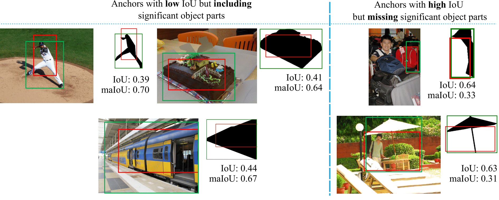

The official implementation of Mask-aware IoU and maYOLACT detector. Our implementation is based on [mmdetection](https://github.com/open-mmlab/mmdetection).

> [**Mask-aware IoU for Anchor Assignment in Real-time Instance Segmentation**](TBC),            
> [Kemal Oksuz](https://kemaloksuz.github.io/), Baris Can Cam, Fehmi Kahraman, Zeynep Sonat Baltaci, [Emre Akbas](http://user.ceng.metu.edu.tr/~emre/), [Sinan Kalkan](http://www.kovan.ceng.metu.edu.tr/~sinan/),
> *BMVC 2021. ([arXiv pre-print](TBC))*


## Summary

**Mask-aware IoU:** Mask-aware IoU (maIoU) is an IoU variant for better anchor assignment to supervise instance segmentation methods. Unlike the standard IoU, Mask-aware IoU also considers the ground truth masks while assigning a proximity score for an anchor. As a result, for example, if an anchor box overlaps with a ground truth box, but not with the mask of the ground truth, e.g. due to occlusion, then it has a lower score compared to IoU. Please check out the examples below for more insight. Replacing IoU by our maIoU in the state of the art ATSS assigner yields both performance improvement and efficiency (i.e. faster inference) compared to the standard YOLACT method. 

<p align="center">
  
</p>

**maYOLACT Detector:** Thanks to the efficiency due to ATSS with maIoU assigner, we incorporate more training tricks into YOLACT, and built maYOLACT Detector which is still real-time but significantly powerful (around 6 AP) than YOLACT. Our best maYOLACT model reaches SOTA performance by 37.7 mask AP on COCO test-dev at 25 fps.

## How to Cite

Please cite the paper if you benefit from our paper or the repository:
```
@inproceedings{maIoU,
       title = {Mask-aware IoU for Anchor Assignment in Real-time Instance Segmentation},
       author = {Kemal Oksuz and Baris Can Cam and Fehmi Kahraman and Zeynep Sonat Baltaci and Sinan Kalkan and Emre Akbas},
       booktitle = {The British Machine Vision Conference (BMCV)},
       year = {2021}
}
```

## Specification of Dependencies and Preparation

- Please see [get_started.md](docs/install.md) for requirements and installation of mmdetection.
- Please refer to [introduction.md](docs/getting_started.md) for dataset preparation and basic usage of mmdetection.

## Trained Models
Here, we report results in terms of AP (higher better) and oLRP (lower better).

### Multi-stage Object Detection 

#### Comparison of Different Assigners (on COCO minival)

|    Scale     |  Assigner  | mask AP |  mask oLRP |  Log  | Config | Model |
| :-------------: | :-----: | :------------: | :------------: | :-------: | :-------: |:-------: |
|    400    |  Fixed IoU  | 24.8 | 78.3 |[log](https://drive.google.com/file/d/1WxebikClTJIaHYxTfw7BUSOS3wZFlOOh/view?usp=sharing) | [config](configs/mayolact/yolact_r50_4x8_coco_scale400.py) | [model](https://drive.google.com/file/d/1juGIBsbyxb-FPKpssSSYQniTDUt8XRac/view?usp=sharing)  |
|    400    |  ATSS w. IoU  | 25.3 | 77.7 |[log](https://drive.google.com/file/d/1R-uHrZtvZ3loei0cP2FN8higOnP2ERgv/view?usp=sharing) | [config](configs/mayolact/yolact_r50_4x8_coco_scale400_ATSSwIoU.py) | [model](https://drive.google.com/file/d/1ZofI86srVyHwhEeOKGg8gIbGJiTZjW2f/view?usp=sharing)  |
|    400    |  ATSS w. maIoU  | 26.1 | 77.1 |[log](https://drive.google.com/file/d/1nkHcvveQSrVhPzMIsmDjhUZagfbg4NF7/view?usp=sharing) | [config](configs/mayolact/yolact_r50_4x8_coco_scale400_ATSSwmaIoU.py) | [model](https://drive.google.com/file/d/1ZM6izGY_zPDwuPSTienYpJCW9zFxZKIk/view?usp=sharing)  |
|    550    |  Fixed IoU  | 28.5 | 75.2 |[log](https://drive.google.com/file/d/1FGR-uxeABGcvX8GSy56vCiowQZWbl5F8/view?usp=sharing) | [config](configs/mayolact/yolact_r50_4x8_coco_scale550.py) | [model](https://drive.google.com/file/d/1nUyT2rhnYxVa4vNd3BccOwchWKYAnLJp/view?usp=sharing)  |
|    550    |  ATSS w. IoU  | 29.4 | 74.5 |[log](https://drive.google.com/file/d/1MLzwxnKLrYT3rJ17QciOFTEVvMYR2vMY/view?usp=sharing) | [config](configs/mayolact/yolact_r50_4x8_coco_scale550_ATSSwIoU.py) | [model](https://drive.google.com/file/d/1j2eqLPWzmNOtD5M5E1igMDgVhllQGezk/view?usp=sharing)  |
|    550    |  ATSS w. maIoU  | 30.4 | 73.7 |[log](https://drive.google.com/file/d/1x1Rqh9CP-XxfU3LKqVfXCe438KtEN8jM/view?usp=sharing) | [config](configs/mayolact/yolact_r50_4x8_coco_scale550_ATSSwmaIoU.py) | [model](https://drive.google.com/file/d/16Q_MjLsA-vMHpvU_CNxG94Qd4U2P1kjA/view?usp=sharing)  |
|    700    |  Fixed IoU  | 29.7 | 74.3 |[log](https://drive.google.com/file/d/17fFPT_40tAFjwbmdlgQrBRfdo4txpc8p/view?usp=sharing) | [config](configs/mayolact/yolact_r50_4x8_coco_scale700.py) | [model](https://drive.google.com/file/d/1X6iwNV39-1juMfzbwaJxBqLcrERleiQK/view?usp=sharing)  |
|    700    |  ATSS w. IoU  | 30.8 | 73.3 |[log](https://drive.google.com/file/d/1QQQhD_47vkYZYEXKCliC9fzJHabaXEpY/view?usp=sharing) | [config](configs/mayolact/yolact_r50_4x8_coco_scale700_ATSSwIoU.py) | [model](https://drive.google.com/file/d/1jOoiPLguZ4x6dihDNuHurI4iTLawCtVw/view?usp=sharing)  |
|    700    |  ATSS w. maIoU  | 31.8 | 72.5 |[log](https://drive.google.com/file/d/1YuglESo8gt8fEbDavaCKoPd-gSAVDLs6/view?usp=sharing | [config](configs/mayolact/yolact_r50_4x8_coco_scale700_ATSSwmaIoU.py) | [model](https://drive.google.com/file/d/1uUMUOQoes-biTIMx3JeFcwMnhGMIBxYH/view?usp=sharing)  |

### maYOLACT Detector (on COCO test-dev)

|    Scale     |  Backbone  | mask AP | fps |  Log  | Config | Model |
| :-------------: | :-----: | :------------: | :------------: | :-------: | :-------: | :-------: |
| maYOLACT-550 |    ResNet-50 |   35.2  |   30  |[log](https://drive.google.com/file/d/1Ya2V728qtS5WTl7V-hS052DPETXh8c6b/view?usp=sharing)| [config](configs/ranksort_loss/ranksort_atss_r50_fpn_1x_coco.py) | [model](https://drive.google.com/file/d/1yQ0gVXSIK2SOvwyYjv9vT5DqFcExZ5Ty/view?usp=sharing) |
| maYOLACT-700 |    ResNet-50 |   37.7  |   25  |[log](https://drive.google.com/file/d/1nEYfrgFPX24AXy13UB0vddASeu3tFTG7/view?usp=sharing)| [config](configs/ranksort_loss/ranksort_paa_r50_fpn_1x_coco.py) | [model](https://drive.google.com/file/d/1oGILFHoaFEOkh0ba-9bIHkw3yrzXcQ5I/view?usp=sharing) |

## Running the Code

### Training Code
The configuration files of all models listed above can be found in the `configs/mayolact` folder. You can follow [get_started.md](docs/get_started.md) for training code. As an example, to train maYOLACT using images with 550 scale on 4 GPUs as we did, use the following command:

```
./tools/dist_train.sh configs/mayolact/mayolact_r50_4x8_coco_scale550.py 4
```

### Test Code
The configuration files of all models listed above can be found in the `configs/mayolact` folder. You can follow [get_started.md](docs/getting_started.md) for test code. As an example, first download a trained model using the links provided in the tables below or you train a model, then run the following command to test a model model on multiple GPUs:

```
./tools/dist_test.sh configs/mayolact/mayolact_r50_4x8_coco_scale550.py ${CHECKPOINT_FILE} 4 --eval bbox segm 
```
You can also test a model on a single GPU with the following example command:
```
python tools/test.py configs/mayolact/mayolact_r50_4x8_coco_scale550.py ${CHECKPOINT_FILE} --eval bbox segm
```
